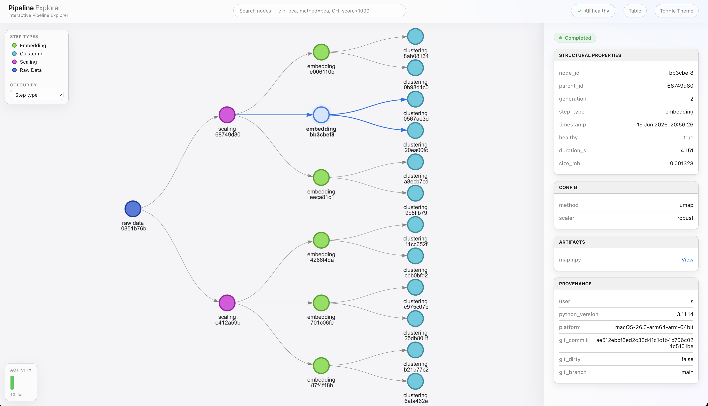

# Ancestree

[](https://pypi.org/project/ancestree/)
[](https://www.python.org/downloads/)
[](LICENSE)
[](https://github.com/JS195/ancestree/actions)
[](https://github.com/JS195/ancestree/actions/workflows/ci.yml)
[](https://codecov.io/gh/JS195/ancestree)

**Exploratory pipeline tracking that sits in the gap between a messy folder-naming convention and a heavy lineage platform.**



No server, no database, no dependencies. `pip install` + a local directory. Works for any iterative workflow, not just machine learning. Runs where the others aren't allowed to: air-gapped clusters, locked-down corporate environments, anywhere cloud software is banned.

---

## Contents

- [Why Ancestree?](#why-ancestree)
- [What makes it different](#what-makes-it-different)
- [Installation](#installation)
- [Quick start](#quick-start)
- [What's recorded automatically](#whats-recorded-automatically)
- [Searching and Querying](#searching-and-querying)
- [The Pipeline Explorer](#the-pipeline-explorer)
- [Development](#development)
- [License](#license)

---

## Why Ancestree?

Iterative workflows are messy. You run ten variations, tweak parameters, rerun branches, and two weeks later you're staring at `final_v2_REAL.csv` wondering which preprocessing produced it and whether the code that made it was even committed. As your project grows, and you want to explore many ideas in parallel, or branch off a promising result and try multiple different things with it, a 'good folder naming convention' isn't going to cut it.

This is a problem in machine learning, but it's just as common in simulation, optimisation, data engineering, and document processing; any workflow where steps build on each other and results branch. Tools like MLflow solve it well, but only if you're doing ML and willing to stand up a server, otherwise the options are thin.

Ancestree solves this modelling the pipeline as a directed acyclic graph. **Every step of your pipeline is a local node folder**. A node is just a directory that holds the step's outputs plus a metadata record describing where it came from. Chain nodes together and you get a complete, queryable family tree of your work that is durable on disk, reconstructable at any time, and visual when you want it to be.

One of Ancestree's first production use cases was an iterative optimisation, with 10+ generations, 3 steps per generation, and dozens of branches.

---

## What makes it different

**It enforces lineage — it doesn't just record it.**
`rules={"model": ["clean"]}` makes an illegal pipeline transition a `ValueError` at creation time. Every other tracker is a passive logbook. This is an active grammar for your pipeline.

**Files are the database. There is no lock-in.**
Every node is a plain directory. Every record is a human-readable `meta.json` sitting next to the artifacts it describes. You can `grep` it, `rsync` it, zip it, commit it. Uninstall Ancestree tomorrow — your lineage is still legible. The index is a disposable cache; delete it and it rebuilds from disk.

**Forensic crash semantics.**
A step that dies mid-run keeps its partial output, flagged `healthy=False` and searchable. A step that wrote nothing vanishes without a trace. Partial work is evidence, not garbage.

**Reproducibility honesty, zero config.**
Every node captures who ran it, on what platform, with what Python, at which git commit — and a dirty-worktree flag surfaced as a first-class warning in the UI.

**The UI is one file you can email.**
The entire explorer — lineage graph, metadata search, health indicators, metric heatmap, sortable runs table, cmd-click diff, activity timeline, dark mode — is a single self-contained HTML file that opens from `file://`. Attach it to a PR, a paper, a Slack message. No login. No server. No link that expires.

**Not ML-shaped.**
Step types are your vocabulary — ETL, simulation, lab protocol, report generation, image processing. The "runs/experiments/models" ontology that ML tools impose isn't here.

---

## Installation

Requires Python 3.9+. No dependencies.

```bash
pip install ancestree
```

## Quick Start

Wrap your existing save calls inside a standard Python context manager.

```python
import ancestree

# Rules declare which step types may follow which — your pipeline's grammar.
store = ancestree.LineageStore(
    root="./my_project",
    rules={"clean": ["ingest"], "model": ["clean"]},
)

# Each step runs inside a context manager. Write files with the / operator,
# attach anything worth remembering with add_meta.
with store.create_node(step_type="ingest") as node:
    df = do_process()

    df.to_csv(node / "raw.csv")
    node.add_meta("rows", len(df))

# One call: a self-contained, interactive map of everything above.
store.generate_web_graph()
```

---

## What's recorded automatically

Every node silently captures critical operational metrics and system reproducibility context without a single line of configuration.


| Captured     | Why it matters                                                                                                                |
| ------------ | ----------------------------------------------------------------------------------------------------------------------------- |
| `parent_id`  | Where the step came from                                                                                            |
| `generation`  | What generation the step is. Useful for iterative workflows if numerous steps happen in one generation.                          |
| `step_type`  | The pipeline step being performed                                                                                               |
| `timestamp`  | When the step ran                                                                                                             |
| `duration_s` | How long it took. Find slow steps, see the pipeline getting slower                                                        |
| `size_mb`    | Total size of the node's artifacts                                                                                            |
| `healthy`    | Whether the step completed, or raised mid-run                                                                                 |
| `provenance`   | User, Python version, platform, git commit/branch, and a **dirty-worktree flag** so you know when a result isn't reproducible |

---

## Searching and Querying

Because your execution history is structured as a proper lineage Directed Acyclic Graph (DAG) instead of a flat list of independent runs, you can ask your codebase complex ancestral questions using plain Python and native lambdas.

```python
store.find_node(step_type="model")                          # all model runs
store.find_node(accuracy=lambda a: a and a > 0.9)           # the good ones
store.get_most_recent_node(step_type="clean")               # resume where you left off
store.get_lineage(best_model)                               # its full ancestry, oldest first
store.find_in_lineage(best_model, step_type="clean")        # which cleaning produced it?
best_model.artifacts("*.bin")                                # locate its files
store.prune(bad_branch)                                      # preview a deletion (dry-run first)
```

---

## The Pipeline Explorer


`generate_web_graph()` renders the entire store into **one self-contained HTML file** — every style and script inlined, so it opens anywhere and ships as-is to a colleague or a static site.

Inside it:

- **Lineage graph** — nodes laid out by generation and coloured by step type; hovering a node lights up its complete ancestry and descendants.
- **Search that understands your metadata** — free text, `field=value`, and numeric operators like `accuracy>0.9` allow easy navigation.
- **Compare** — cmd-click two nodes for an aligned diff: identical values recede, differences are highlighted with numeric deltas.
- **Rich metadata** — inline images, file links, and pandas DataFrames rendered as tables (`data_type="table"`), grouped into sections you define. Light and dark themes included.
- **Runs table** — flip the graph into a sortable table of runs × metrics: the "pick the best run" view when decisions trade accuracy against runtime against data size.

---

## Development
Built to be resilient. The test suite includes 158 verified tests protecting against file corruption, multi-threaded write races, and adversarial edge cases.

Issues and PRs welcome.

Have a feature request or found a bug? Open an issue or reach out directly at [josh.smith195@outlook.com](mailto:josh.smith195@outlook.com).

```bash
git clone https://github.com/JS195/ancestree.git
cd ancestree
pip install -e .
python -m pytest tests/
```

---

## License

[MIT](LICENSE) © Joshua Smith
